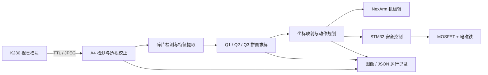

# 智能拼图装置｜2026 年电赛 E 题

[English](README_EN.md) · 简体中文

[](https://github.com/fear66six/2026ds/actions/workflows/ci.yml)
[](LICENSE)
[](https://www.python.org/)
[](https://developer.nvidia.com/embedded-computing)

> 🏆 **全国大学生电子设计竞赛国赛一等奖项目**
>
> 一套从视觉感知、拼图求解到机械臂抓放的端到端机器人系统。

本项目以 Jetson 为主控，通过 K230 获取工作区图像，完成 A4 工作面校正、碎片检测、拼图求解、坐标映射与动作规划，再驱动 NexArm 机械臂和 STM32 电磁铁执行抓取与放置。工程覆盖固定四片、随机几何碎片和扑克牌碎片三类任务，并提供离线测试、Mock 执行、运行审计和触控启动器。

> 奖项信息由项目负责人提供；当前公开仓库未包含获奖证书。赛题名称和任务边界可追溯到项目保存的正式赛题资料，详见[证据与边界](#证据与边界)。

## 效果展示

| 碎片识别 | 拼图结果 |
|---|---|
|  |  |

上图为仓库内 Q1 历史运行记录的可视化结果：黄色表示待搬运碎片，绿色表示已放置碎片。图片用于展示算法流程，不单独证明当前实机的最终机械精度。

## 项目亮点

- **端到端闭环工程**：从相机协议、视觉校正、几何求解到机械臂与电磁铁控制，形成完整软件链路。
- **三类拼图任务**：固定模板、随机多边形 DFS/回溯、扑克牌边缘与花纹匹配共享同一套标定和执行框架。
- **安全优先的硬件控制**：规划与真实执行分离；动作入口要求任务专属确认令牌；电磁铁采用限时租约、状态确认与异常断电。
- **可复现与可审计**：视觉、规划和执行结果保存为图像与 JSON；核心逻辑支持 Mock 和纯离线测试。
- **面向现场的鲁棒性**：处理 A4 边缘轻微出画、串口设备持久路径、机械臂反馈不稳定和拼缝容差等实际问题。

## 三项任务

| 任务 | 问题 | 方法 | 入口 |
|---|---|---|---|
| Q1 固定四片 | 将四片同色碎片拼成目标矩形 | A4 透视校正、轮廓匹配、刚体变换与固定模板规划 | `python -m q1.main` |
| Q2 随机几何拼图 | 将 1–4 片白色多边形拼成矩形 | 多边形检测、开放边建模、DFS/回溯与几何约束剪枝 | `python -m q2.main` |
| Q3 扑克牌拼图 | 恢复被裁切的扑克牌 | 边缘几何、花纹连续性、候选评分与限时搜索 | `python -m q3.main` |

## 系统架构



系统把视觉与规划统一到 A4 纸面毫米坐标，再通过标定矩阵映射到机械臂坐标。Q1、Q2、Q3 共用相机、标定、运动时序和安全控制，差异集中在碎片检测与求解器。更完整的模块边界见[系统架构](docs/ARCHITECTURE.md)。

## 仓库结构

```text
.
├── 2026E/
│   ├── q1/                    # 固定四片与公共视觉/控制框架
│   ├── q2/                    # 随机几何拼图
│   ├── q3/                    # 扑克牌拼图
│   ├── drivers/               # K230 ↔ Jetson 取图协议
│   ├── hardware/              # NexArm 通信实现
│   └── tools/                 # Jetson 触控启动器
├── drivers/                   # Jetson 侧 STM32 电磁铁驱动
├── firmware/                  # STM32 电磁铁固件与协议
├── tests/                     # 公共离线测试
├── docs/                      # 架构、复盘、事实、决策与接口文档
├── assets/showcase/           # README 展示素材
└── TaskSuite_E/               # 早期 K230/Arduino 方案，保留作历史参考
```

`pintu/` 是本地只读外部参考工程，不属于本项目发布内容，也不得修改或提交。

## 快速开始

建议使用 Python 3.10+。以下步骤不会连接真实硬件：

```bash
python -m venv .venv
# Linux / macOS
source .venv/bin/activate
# Windows PowerShell
# .venv\Scripts\Activate.ps1

python -m pip install -r requirements-dev.txt
python -m pytest -q
```

在 Jetson 上运行时，以 `2026E/` 为工作目录。仅拍照与规划会访问 K230，但不会打开机械臂或电磁铁串口：

```bash
cd 2026E
python3 -m q1.main plan --robot-config q1/config/robot_config.json \
  --camera-backend k230_ttl --confirm CAPTURE_AND_PLAN
```

Q2、Q3 分别将模块名替换为 `q2.main`、`q3.main`。真实执行会产生机械运动并控制电磁铁，不应把仓库中的端口、位姿或标定值直接用于另一台设备；完整命令和核对项见[开发与运行指南](docs/DEVELOPMENT.md)。

## 文档导航

| 文档 | 面向读者 | 内容 |
|---|---|---|
| [项目复盘](docs/PORTFOLIO.md) | 面试官 / 作品集读者 | 问题、方案、难点、成果和可讲述要点 |
| [系统架构](docs/ARCHITECTURE.md) | 开发者 | 模块、数据流、任务复用和安全边界 |
| [开发与运行指南](docs/DEVELOPMENT.md) | 使用者 / 贡献者 | 环境、测试、规划、真机运行与排障入口 |
| [资料导航](docs/README.md) | 深入核查者 | 原始资料、接口文档和历史材料索引 |
| [项目事实](docs/PROJECT_FACTS.md) | 维护者 | 有来源的长期事实 |
| [工程决策](docs/DECISIONS.md) | 维护者 | 关键设计选择及依据 |
| [待验证项](docs/TODO_VERIFY.md) | 维护者 | 尚需实机确认的结论 |
| [开源发布检查](docs/OPEN_SOURCE_CHECKLIST.md) | 仓库所有者 | 许可、第三方代码、隐私和发布前清理 |
| [贡献指南](CONTRIBUTING.md) | 贡献者 | 开发流程、证据要求和硬件安全边界 |
| [支持与安全](SUPPORT.md) | 使用者 | 获取帮助和报告安全问题的方式 |

## 安全说明

- 导入模块和构造对象不应自动连接硬件；真实访问必须由入口显式触发。
- `plan` 与 `run` 分离，真实执行要求任务专属确认令牌。
- STM32 电磁铁使用超时租约并在异常与退出路径中强制关闭。
- `completed=true` 只说明软件流程走完，不等于机械臂反馈到位或最终拼放通过视觉复核。
- 未完成设备型号、接线、串口、标定、运动范围和急停核对前，不要运行真实执行命令。

## 证据与边界

| 结论 | 主要来源 | 类型 | 可信等级 | 实机验证 |
|---|---|---|---|---|
| 赛题名称与任务边界 | `docs/E题_拼图装置.pdf` 第 1–2 页；摘要见 `docs/PROJECT_FACTS.md` F-001/F-012 | 正式赛题资料 | B | 不需要 |
| 国赛一等奖 | 项目负责人在本次开源整理中提供 | 用户项目信息 | D | 发布证书可进一步佐证 |
| 三套 plan/run 入口 | `2026E/q1/main.py`、`q2/main.py`、`q3/main.py` | 当前源码 | A | `plan` 需相机，`run` 需实机 |
| K230 请求式 JPEG 链路 | `2026E/drivers/k230_ttl_camera/` | 当前源码 | A | 已有项目运行记录 |
| 电磁铁租约与异常关闭 | `drivers/stm32_magnet_uart.py`、`firmware/stm32f103ve_uart_magnet/PROTOCOL.md` | 当前源码 / 协议 | A | 接线和负载仍须现场复核 |

可信等级沿用项目约定：A 为源码直接确认，B 为对应正式资料，D 为用户项目决策或项目方提供信息。仓库中的历史运行记录只证明对应时间、配置和设备状态下的结果。

## 开源许可

本项目原创代码与文档采用 [MIT License](LICENSE)。仓库包含的 ARM/ST CMSIS、厂商 NexArm SDK 和来源仍需逐项确认的历史代码不因根许可证而自动改为 MIT，使用和再分发时须同时遵守其各自条款，详见[第三方代码与许可说明](THIRD_PARTY_NOTICES.md)。

公开发布前仍应完成来源、隐私和历史记录检查，详见[开源发布检查](docs/OPEN_SOURCE_CHECKLIST.md)。

如果这个项目对你的机器人或电赛实践有帮助，欢迎 Star、引用或通过 Issue 分享改进建议。
