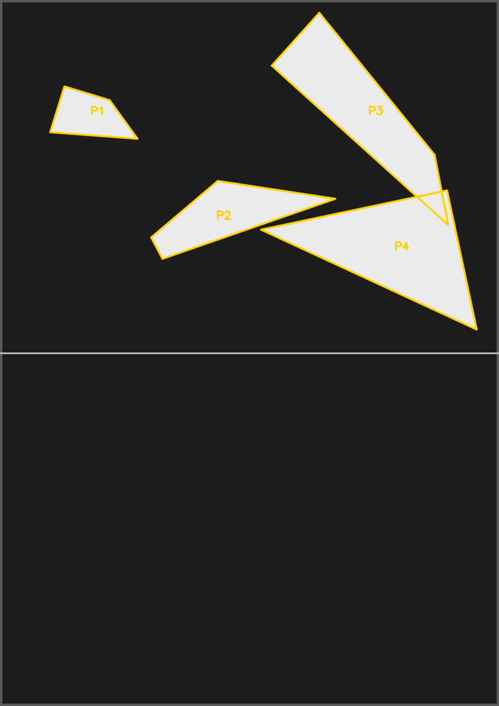
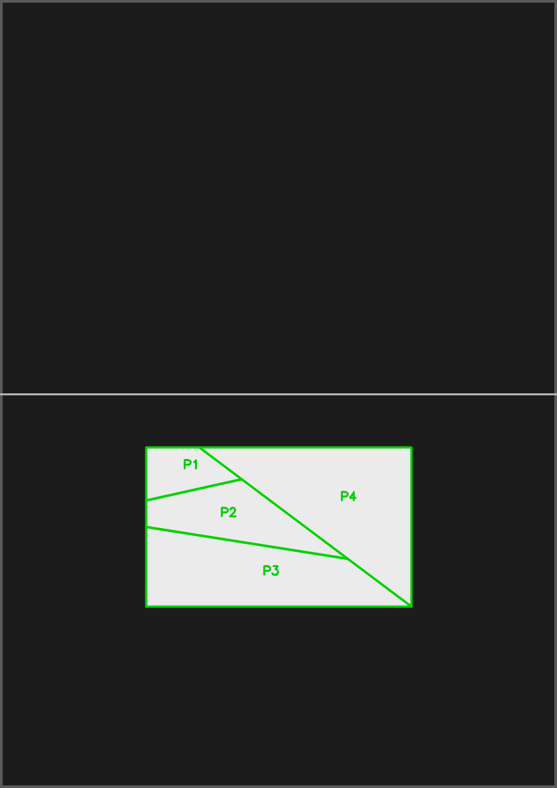
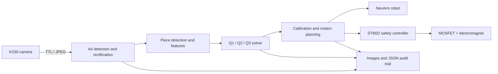

# Intelligent Puzzle Assembly Robot | 2026 NUEDC Problem E

English · [简体中文](README.md)

[](https://github.com/fear66six/2026ds/actions/workflows/ci.yml)
[](LICENSE)
[](https://www.python.org/)
[](https://developer.nvidia.com/embedded-computing)

> 🏆 **National First Prize project in the National Undergraduate Electronics Design Contest (NUEDC)**

An end-to-end robot that captures a workspace with a K230 vision module, rectifies the A4 work surface, detects puzzle pieces, solves their target arrangement, maps paper coordinates to robot coordinates, and commands a NexArm robot plus an STM32-controlled electromagnet to execute pick-and-place operations.

The award statement was provided by the project owner. The public repository currently does not contain a certificate; the evidence boundary is documented in the [Chinese README](README.md#证据与边界).

## Demo

| Piece detection | Planned assembly |
|---|---|
|  |  |

Yellow outlines represent pieces waiting to be moved; green outlines represent placed pieces. These images demonstrate the software pipeline and do not, by themselves, establish the current robot's physical placement accuracy.

## Why this project is useful

- **Complete robotics pipeline:** camera protocol, perspective correction, puzzle solving, calibration, motion planning, and actuator control live in one traceable system.
- **Three puzzle families:** fixed four-piece templates, random polygon search, and playing-card reconstruction share one calibration and execution framework.
- **Hardware-safe design:** planning and physical execution are separate; real motion requires task-specific confirmation tokens; the electromagnet uses a timed lease and emergency shutdown.
- **Reproducible diagnostics:** captures, visualizations, scenes, and move plans are recorded as images and JSON, while core behavior has Mock and offline test paths.
- **Field-driven robustness:** the implementation addresses partially cropped paper borders, persistent serial paths, unreliable robot feedback, surface tilt, and seam clearance.

## Tasks

| Task | Goal | Core approach |
|---|---|---|
| Q1 | Assemble four known pieces into a rectangle | Perspective rectification, contour/template matching, rigid transforms |
| Q2 | Assemble 1–4 random white polygons | Open-edge model, DFS/backtracking, geometric pruning |
| Q3 | Reconstruct a cut playing card | Edge geometry, pattern continuity, candidate scoring, bounded search |

## Architecture



See [Architecture](docs/ARCHITECTURE.md) for module boundaries and source-level evidence.

## Repository map

```text
2026E/q1/                    Shared runtime + fixed four-piece task
2026E/q2/                    Random polygon puzzle
2026E/q3/                    Playing-card puzzle
2026E/drivers/               K230 ↔ Jetson image protocol
2026E/hardware/              NexArm integration
drivers/                     STM32 electromagnet host driver
firmware/                    STM32 firmware and protocol
tests/                       Offline tests
docs/                        Architecture, engineering evidence, and guides
assets/showcase/             Curated public demo assets
TaskSuite_E/                 Earlier K230/Arduino implementation
```

`pintu/` is a local, read-only external reference tree. It is not part of the public project and must not be committed.

## Quick start (offline and hardware-free)

Python 3.10 or newer is recommended.

```bash
python -m venv .venv
source .venv/bin/activate       # Linux / macOS
# .venv\Scripts\Activate.ps1   # Windows PowerShell

python -m pip install -r requirements-dev.txt
python tools/check_repo.py
python -m pytest -q
```

## Plan-only mode

Run from `2026E/` on the Jetson. This accesses the configured camera but does not open the robot or electromagnet serial ports:

```bash
cd 2026E
python3 -m q1.main plan --robot-config q1/config/robot_config.json \
  --camera-backend k230_ttl --confirm CAPTURE_AND_PLAN
```

Replace `q1.main` with `q2.main` or `q3.main` for the other tasks. Do not reuse the repository's serial paths, poses, calibration, or safety limits on another machine. See the [Development and Operation Guide](docs/DEVELOPMENT.md) before any hardware work.

## Documentation

- [Project retrospective / portfolio narrative](docs/PORTFOLIO.md)
- [System architecture](docs/ARCHITECTURE.md)
- [Development and operation guide](docs/DEVELOPMENT.md)
- [Confirmed facts](docs/PROJECT_FACTS.md), [engineering decisions](docs/DECISIONS.md), and [verification backlog](docs/TODO_VERIFY.md)
- [Contributing](CONTRIBUTING.md), [support](SUPPORT.md), and [security policy](SECURITY.md)
- [Third-party notices](THIRD_PARTY_NOTICES.md)

## License

Original project code and documentation are available under the [MIT License](LICENSE). ARM/ST support files, the vendor-derived NexArm SDK, and other mixed-origin files remain subject to their respective terms; see [Third-party notices](THIRD_PARTY_NOTICES.md).

If this project helps your robotics or competition work, consider starring it, citing it, or sharing your improvements through an Issue or Pull Request.
