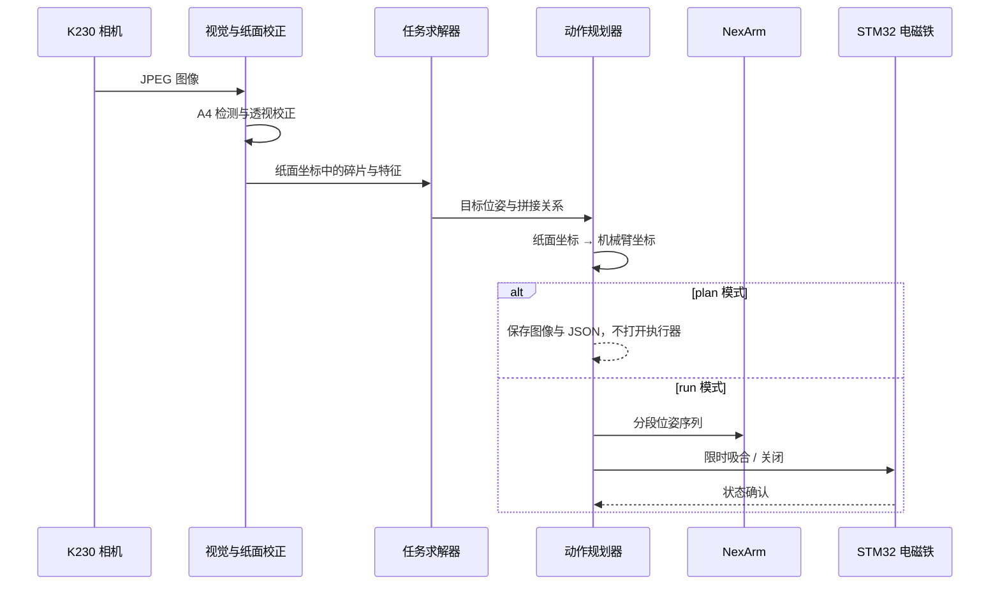

# 系统架构

本文描述当前正式实现的模块边界。代码行为以当前源码为准；硬件型号、电气连接、物理单位与安全范围仍须回到原始资料和实机核查。

## 设计目标

系统需要在同一套硬件上完成三类拼图任务，并将算法结果可靠地转换为真实机械动作。架构因此围绕三个原则组织：

1. 视觉、求解和执行分层，算法可以离线验证；
2. 三项任务复用相机、标定和硬件控制，只替换任务相关检测与求解；
3. 任何真实硬件访问都通过显式入口、确认令牌和可关闭的资源生命周期触发。

## 数据流



## 模块职责

| 层 | 路径 | 责任 | 主要接口 / 符号 |
|---|---|---|---|
| 任务入口 | `2026E/q1/main.py`、`q2/main.py`、`q3/main.py` | 参数解析、plan/run 隔离、组件装配 | `run_plan`、`build_controller`、`run_full` |
| 相机协议 | `2026E/drivers/k230_ttl_camera/` | Jetson 与 K230 的请求式 JPEG 传输 | `k230_camera.py`、`protocol.py` |
| 纸面视觉 | `2026E/q1/vision.py`、`q1/analyzer.py` | A4 检测、透视校正、Q1 碎片识别 | `detect_paper`、`SceneAnalyzer.analyze` |
| Q1 规划 | `2026E/q1/motion.py` | 模板匹配后的刚体动作、拼缝与位姿规划 | `plan_piece_moves` |
| Q2 求解 | `2026E/q2/puzzle_solver/` | 多边形边匹配、DFS/回溯和矩形验证 | `PuzzleSolver.solve` |
| Q3 求解 | `2026E/q3/card_solver/` | 扑克牌边缘、花纹评分和限时搜索 | `CardPuzzleSolver.solve` |
| 坐标标定 | `2026E/q1/calibration.py` | 纸面毫米坐标到机械臂坐标的映射 | `ArmCoordinateMapper` |
| 机械执行 | `2026E/q1/executors/nexarm.py` | 抓取、抬升、转腕、搬运、释放与收尾 | `NexArmRobotExecutor.execute_single_move` |
| 电磁铁 | `drivers/stm32_magnet_uart.py`、`2026E/q1/magnet.py` | 串口协议、限时租约、健康检查和异常关闭 | `STM32MagnetUART`、`STM32MagnetController` |
| 运行审计 | `2026E/q1/workflow.py`、`q2/workflow.py`、`q3/workflow.py` | 保存原图、可视化、场景和动作队列 | `capture_and_plan` |

## 三项任务如何复用

Q1 是公共运行框架的承载者，提供相机适配、A4 坐标系、机械臂标定、电磁铁会话和执行器。Q2 与 Q3 复用这些模块，但各自保留检测器与求解器：

```text
公共：K230 → A4 校正 → 纸面毫米坐标 → 标定映射 → NexArm / STM32
                         ├── Q1：固定模板与刚体规划
                         ├── Q2：随机多边形 DFS / 回溯
                         └── Q3：扑克牌边缘 + 花纹匹配
```

所有任务从 `2026E/q1/config/robot_config.json` 读取同一套部署参数，以避免多份 HOME、串口、标定矩阵和动作时序相互漂移。该文件包含特定实机的历史值，迁移设备时必须重新核验。

## 安全边界

| 边界 | 设计措施 | 不能证明的事项 |
|---|---|---|
| 算法与硬件 | `plan` 不构造机械臂和电磁铁执行链 | `plan` 仍会访问配置的相机 |
| 误启动 | `run` 要求 Q1/Q2/Q3 各自的精确确认令牌 | 令牌不能代替现场急停和人员检查 |
| 电磁铁失控 | 限时租约、周期续租、状态确认、异常关闭 | 不能代替正确的 MOSFET 接线和供电保护 |
| 机械臂到位 | 分段动作和保守等待时间 | 软件流程完成不等于反馈闭环确认到位 |
| 可追溯性 | 保存输入图像、场景、规划和执行记录 | 历史记录不能证明新设备或新标定仍有效 |

## 事实来源

| 结论 | 来源与定位 | 来源类型 | 可信等级 | 实机验证 |
|---|---|---|---|---|
| 三项任务具有独立入口并共享运行配置 | `2026E/q1/main.py::_load_runtime`、`q2/main.py::_load_runtime`、`q3/main.py::_load_runtime` | 当前源码 | A | 配置值需实机复核 |
| Q2 使用 DFS/回溯式候选搜索 | `2026E/q2/puzzle_solver/solver.py::PuzzleSolver._dfs` | 当前源码 | A | 不需要 |
| Q3 使用限时搜索并区分 best-effort | `2026E/q3/card_solver/solver.py::CardPuzzleSolver.solve`、`_budget_exceeded` | 当前源码 | A | 实拍效果需验证 |
| 电磁铁支持超时吸合、关闭与紧急关闭 | `drivers/stm32_magnet_uart.py::STM32MagnetUART` | 当前源码 | A | 串口与负载需实机复核 |
| NexArm 执行器包含安全收尾 | `2026E/q1/executors/nexarm.py::emergency_stop`、`close` | 当前源码 | A | 真实运动需现场验证 |

